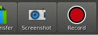

# Computational Reflection Research Group Veyon Fork

[](https://github.com/ComputationalReflection/veyon/releases)
[](LICENSE)

## What is Veyon?

[Veyon (Virtual Eye On Networks)](https://veyon.io/) is a free and open source software for computer monitoring and classroom
management supporting Windows and Linux. It enables teachers to view and control
computer labs and interact with students. Veyon is available in many different
languages and provides numerous features supporting teachers and administrators
at their daily work:

  * Overview: monitor all computers in one or multiple locations or classrooms
  * Remote access: view or control computers to watch and support users
  * Demo: broadcast the teacher's screen in realtime (fullscreen/window)
  * Screen lock: draw attention to what matters right now
  * Communication: send text messages to students
  * Start and end lessons: log in and log out users all at once
  * Screenshots: record learning progress and document infringements
  * Programs & websites: launch programs and open website URLs remotely
  * Teaching material: distribute and open documents, images and videos easily
  * Administration: power on/off and reboot computers remotely

## What is this Veyon version?

This fork of the [Veyon project](https://github.com/veyon/veyon) provides video recording of all the students attending a remote lab. It also allows the storage of a sequence of screenshots instead of a video. We added a new button for video recording to the toolbar.

## Installation and configuration

Installation and configuration of this Veyon version is done in the same way as in the original one, please refer to the official Veyon Administrator Manual at https://docs.veyon.io/en/latest/admin/index.html for information on the installation and configuration of Veyon.

Additionally, our Veyon version is provided with two sets of [Windows and Linux scripts](https://github.com/ComputationalReflection/veyon/tree/master/distribution) that makes it very easy for students and lectures to (un)install, configure, start and stop the system.

## Usage

Please refer to the official Veyon User Manual at https://docs.veyon.io/en/latest/user/index.html for information on how to use Veyon.

### Video Recording Usage

This version of Veyon includes video recording as part of its functionality. When the record button of the toolbar is clicked, the system records one video per lab attendant.



It is possible specify the parameters about how the video should be recorded by modifying the VeyonMaster.json configuration file.
* video (default true): video (true) or a sequence of screenshots (false)
* frame heigth (default 720): size in pixels
* frame Width (default 1280): size in pixels
* CaptureIntervalDen (default 1000): interval time in miliseconds
* CaptureIntervalNum (default 1000): interval time in miliseconds
* SavePath (default %APPDATA%/Record): path to the storage folder

Full Example Configuration 

```shell
...
 "Plugin.Record": {
        "Video": true,
        "CaptureIntervalDen": 1000,
        "CaptureIntervalNum": 1000,
        "Heigth": 720,        
        "Width": 1280,
	"SavePath": "%APPDATA%/Record"
    }
...
```

## Veyon on Linux

### Downloading sources

First grab the latest sources by cloning the Git repository and fetching all submodules:

	git clone --recursive https://github.com/ComputationalReflection/veyon.git && cd veyon


### Installing dependencies

Requirements for Debian-based distributions:

- Build tools: g++ make cmake
- Qt5: qtbase5-dev qtbase5-dev-tools qttools5-dev qttools5-dev-tools
- X11: xorg-dev libxtst-dev
- libjpeg: libjpeg-dev provided by libjpeg-turbo8-dev or libjpeg62-turbo-dev
- zlib: zlib1g-dev
- OpenSSL: libssl-dev
- PAM: libpam0g-dev
- procps: libprocps-dev
- LZO: liblzo2-dev
- QCA: libqca2-dev libqca-qt5-2-dev
- LDAP: libldap2-dev
- SASL: libsasl2-dev
- FFmpeg: libavcodec-dev libavformat-dev libswscale-dev

As root you can run

	apt install g++ make cmake qtbase5-dev qtbase5-dev-tools qttools5-dev qttools5-dev-tools \
	            xorg-dev libxtst-dev libjpeg-dev zlib1g-dev libssl-dev libpam0g-dev \
	            libprocps-dev liblzo2-dev libqca2-dev libqca-qt5-2-dev libldap2-dev \
	            libsasl2-dev libavcodec-dev libavformat-dev libswscale-dev


### Configuring and building sources

Run the following commands:

	mkdir build
	cd build
	cmake ..
	make -j4

NOTE: If you want to build a .deb package for this software, instead of the provided cmake command, you should use:

	cmake -DCMAKE_INSTALL_PREFIX=/usr ..

to install package files in /usr instead of /usr/local.

If some requirements are not fullfilled, CMake will inform you about it and
you will have to install the missing software before continuing.

You can now generate a .deb package

For generating a package you can run

	fakeroot make package

Then you'll get something like veyon_x.y.z_arch.deb

### Installing binaries

	sudo dpkg -i veyon_x.y.z_amd64.deb

## License

Copyright (c) 2020 [Miguel Garcia](http://www.reflection.uniovi.es/miguel) and [Jose Quiroga](http://www.reflection.uniovi.es/quiroga) / [University of Oviedo](http://www.uniovi.es).

See the file COPYING for the GNU GENERAL PUBLIC LICENSE.


## More information

* http://www.reflection.uniovi.es/
* https://veyon.io/
